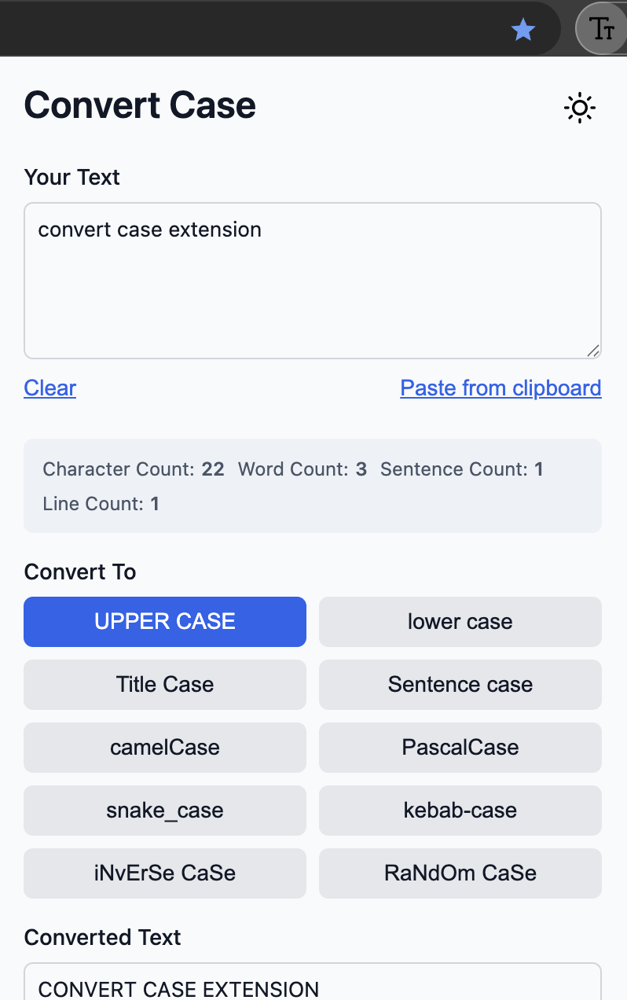
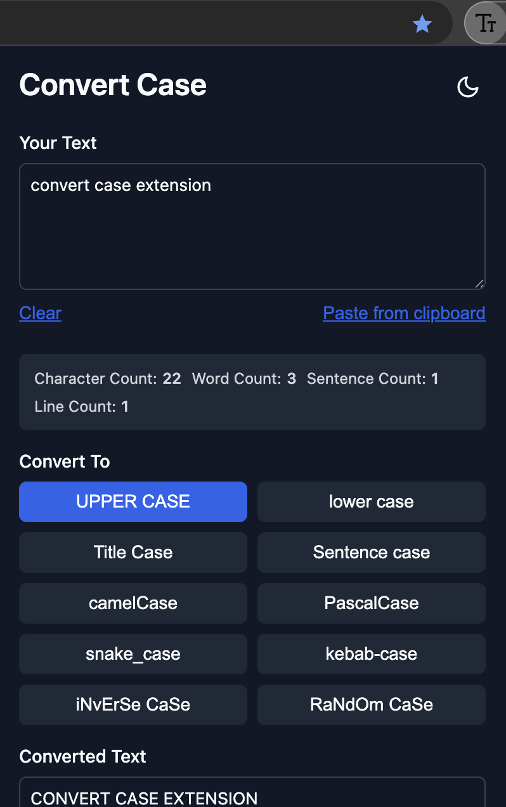

# 📝 Case Converter Chrome Extension

 


A powerful text transformation tool that converts between 10+ case styles instantly. Perfect for developers, writers, and anyone working with text formatting.

## ✨ Key Features

### 🔠 Case Conversion
- **Standard Formats**: UPPERCASE • lowercase • Title Case • Sentence case
- **Code Formats**: camelCase • PascalCase • snake_case • kebab-case
- **Fun Formats**: iNvErSe CaSe • RaNdOm CaSe

### 🛠️ Productivity Tools
- 📋 One-click copy to clipboard
- 💾 Export as TXT/JSON files
- ⏱️ Conversion history (last 5 entries)
- 🌙 Dark/Light mode toggle
- 📊 Real-time text statistics (chars, words, lines)

## 🚀 Installation

### Chrome Web Store
*(Coming soon)*

### Manual Installation
```bash
git clone https://github.com/shrikantgaur/convert-case-extension.git
cd convert-case-extension